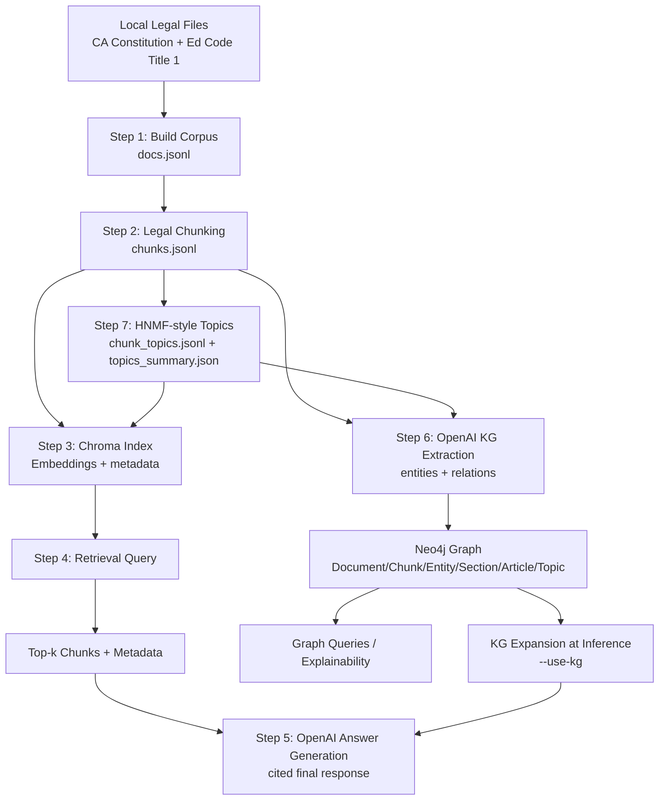

# California Legal RAG (Education Code Title 1 + CA Constitution)

This project builds a lightweight Retrieval‑Augmented Generation (RAG) pipeline over:
- California Education Code **Title 1**
- California Constitution

It includes:
- Corpus building from local files
- Legal‑aware chunking
- HNMF-style topic hierarchy (TF-IDF + NMF approximation)
- Chroma vector indexing
- Retrieval query CLI
- OpenAI RAG answer generation with citations
- Neo4j knowledge graph with entities/relations/topics

## Setup

Create a virtual environment and install dependencies:

```bash
python -m venv .venv
source .venv/bin/activate
pip install -r requirements.txt
```

## Data Location

Place your dataset under a single root folder with subfolders:

```
california_dataset/
  california_constitution/
  education_code/
```

Update the root path in `src/step1_build_corpus.py`:

```
ROOT_FOLDER = Path("/path/to/california_dataset")
```

## Dataset

The dataset is hosted on Google Drive:
```
https://drive.google.com/drive/folders/1Lv-H1qTTgoDB7zDV4Go49OdfEPdytfTm?usp=sharing
```

Download the folder and place it locally as:
```
california_dataset/
  california_constitution/
  education_code/
```

## Pipeline Steps

### Step 1 — Build corpus
```bash
python src/step1_build_corpus.py
```

### Step 2 — Chunk legal docs
```bash
python src/step2_legal_chunks.py
```

### Step 3 — Build Chroma index
```bash
python src/step3_build_index.py --reset
```

### Step 7 — Build topic hierarchy (HNMF-style)
```bash
python src/step7_hnmf_topics.py --depth 2
```

This writes:
- `data/topics/chunk_topics.jsonl`
- `data/topics/topics_summary.json`

Rebuild Chroma with topic metadata:
```bash
python src/step3_build_index.py --reset --topics-path data/topics/chunk_topics.jsonl
```

### Step 7B — Optional TELF HNMFk path (experimental)

If you install TELF and want closer method alignment to HNMFk papers, run:

```bash
python src/step7b_telf_hnmfk_topics.py
```

Then index with TELF topics:

```bash
python src/step3_build_index.py --reset --topics-path data/topics_telf/chunk_topics.jsonl
```

Notes:
- TELF APIs vary by version; `step7b` includes a best-effort adapter.
- Validate output quality before using TELF topics for evaluation claims.

### Step 4 — Query retrieval
```bash
python src/step4_query_rag.py --query "What does Article IX say about education?" --doc-type ca_constitution --article IX --top-k 5
```

### Step 5 — OpenAI RAG answer

Set your API key **locally** (do not commit this):

```bash
export OPENAI_API_KEY="YOUR_KEY_HERE"
```

Then run:

```bash
python src/step5_rag_answer.py --query "What does Article IX say about education?" --doc-type ca_constitution --article IX --top-k 5
```

KG-assisted answering (hybrid vector + graph expansion):
```bash
python src/step5_rag_answer.py --query "What does Article IX say about education?" --doc-type ca_constitution --article IX --top-k 5 --use-kg --kg-expand-k 12
```

### Step 6 — Knowledge Graph (Neo4j)

Set Neo4j env vars locally:

```bash
export NEO4J_URI="neo4j+s://YOUR_INSTANCE.databases.neo4j.io"
export NEO4J_USER="neo4j"
export NEO4J_PASSWORD="YOUR_PASSWORD"
```

Install the Neo4j driver (already in requirements):
```bash
pip install -r requirements.txt
```

Build the KG from a subset of chunks (default 200):
```bash
python src/step6_build_neo4j_kg.py --max-chunks 200
```

Build KG with topic nodes attached to chunks:
```bash
python src/step6_build_neo4j_kg.py --max-chunks 200 --topics-path data/topics/chunk_topics.jsonl
```

Notes:
- Increase `--max-chunks` for a richer graph (costs more API usage).
- You can use smaller values (e.g., 100) for faster demos.
- This creates nodes for `Document`, `Chunk`, `Entity`, `Section`, `Article`, and optionally `Topic`,
  and relations like `MENTIONS`, `MENTIONS_SECTION`, `IN_ARTICLE`, `HAS_CHUNK`, `IN_TOPIC`.
- `--use-kg` in Step 5 requires `NEO4J_URI`, `NEO4J_USER`, and `NEO4J_PASSWORD` to be set.

## Notes

- The pipeline currently supports **Title 1** of the Education Code only.
- Chroma index is stored in `data/chroma` and is excluded from Git.
- For cleaner retrieval, the corpus build step removes Leginfo page boilerplate.

## Architecture Flow


